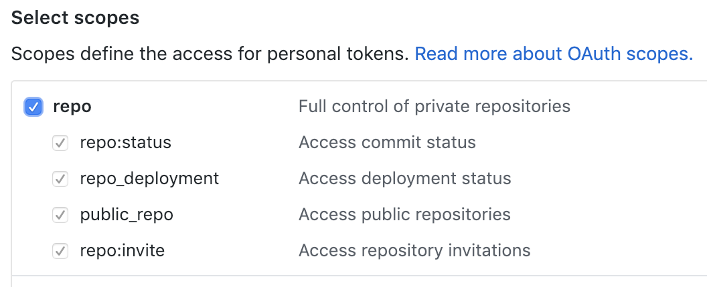

# gie

Github issues exporter

## Getting Started

```console
npm install @januswel/gie
```

For authentication, an environment variable "TOKEN" is used.

```console
export TOKEN=xxxxxxxxxxxxxxxxxxxxxxxxxxxxxxxxxxxxxxxx
```

A `repo` scope is required for private repositories.



## Usage

```
import { Issue } from '@januswel/gie'

const owner = 'januswel'
const repo = 'gie'
Issue.getAll(owner, repo).then(issues => {
  console.log(issues)
})
```

## CLI

```console
TOKEN=xxxxxxxxxxxxxxxxxxxxxxxxxxxxxxxxxxxxxxxx npx @januswel/gie issues januswel gie
```

in CSV

```console
TOKEN=xxxxxxxxxxxxxxxxxxxxxxxxxxxxxxxxxxxxxxxx npx @januswel/gie issues januswel gie --csv
```
